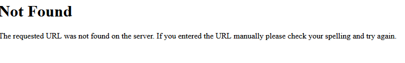
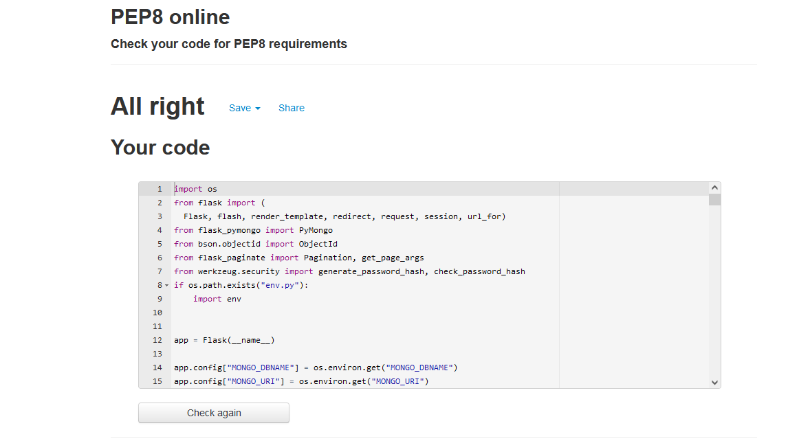

# FOR THE LOVE OF FOOD

[Here is a link to the final project](https://for-the-love-of-food.herokuapp.com/)

## INITIAL DESIGN

* My initial idea for this project was to create a recipe site about food from around the world. My target audience is anyone
who is interested in cooking and all aspects of food, this can cover a huge spectrum of ages, genders and skill levels.
This ranges from children who want to learn how to cook, to anyone who wants to use the site for recipe ideas to create at home.

* The main features that I wanted to include are:
  
  * Easy to use navigation menu.
  * Easy to read content.
  * Easy to see images.
  * Easy to register, login and logout.
  * Easy to Create, Read, Update and Delete recipes.
  * A subtle hint of colour while not being over powering.

## FINAL DESIGN

## CONTENTS

* [User Experience](#user-experience)  
  * [User Stories](#user-stories)

* [Design](#design)
  * [Color Scheme](#color-scheme)

* [Wireframes](#wireframes)

* [Features](#features)
  * [Future Implementations](#future-implementations)
  
* [Solved Bugs](#solved-bugs)

* [Technologies Used](#technologies-used)
  * [Languages](#languages)
  * [Design](#design)
  * [Database](#database)

* [Deployment](#deployment)
  * [Initial Deployment](#initial-deployment)
  * [How To Fork A Repository](#how-to-fork-a-repository)
  * [How To Clone A Repository](#how-to-clone-a-repository)
  * [How To Make A Local Clone](#how-to-make-a-local-clone)

* [Testing](#testing)
  * [Code Validators](#code-validators)

* [Content](#content)
  * [Images](#images)
  * [Text Content](#text-content)

* [Acknowledgements](#acknowledgements)

[Back To Top](#for-the-love-of-food)

## USER EXPERIENCE

The structure of the site was designed to be simple and easy to use. It has a good balance of images and content, so it does not overload the user,
while giving them enough information to create recipes. The step by step structure ensures the user knows what the next steps are and doesn't leave
the user needing more knowledge.

* The website is for the following user types:
  * Users with no previous experience about cooking, or experience on how to cook food, and would like to start learning.
  * Users with basic experience about cooking who wish to hone their cooking skills while practising making new recipes.
  * Users with advanced experience in cooking, who are feeling adventurous and looking for some new recipes.
  * Users who are highly skilled and are looking to add their own twist on recipes that already exist.

[Back To Top](#for-the-love-of-food)

### USER STORIES

#### CLIENT GOALS

* The site needs to be easily accessible.
* The navigation menu needs to be simple to use on a range of devices, including desktop, tablet and mobile.
* Manoeuvering around the site should be simple and straightforward.
* To be able to create an user account.
* It should be easy to Create, Read, Update and Delete recipes.
* The site should be informative and all the text should be easy to read.
* The images should be clear and not stretched or squashed.
* It should be easy to register, login and logout.

[Back To Top](#for-the-love-of-food)

#### FIRST TIME VISITORS

* I want the site to be easy to understand how to navigate throughout the site.
* I want the content to be easily read and understandable.
* I want images to be clearly visible.

[Back To Top](#for-the-love-of-food)

#### RETURNING USER

* To gather information for recipes.
* To recommend the site to friends and family.
* To be able to Create, Read, Update and Delete recipes.
* To save recipes to favourites section.
* To delete recipes to favourites section.

[Back To Top](#for-the-love-of-food)

## DESIGN

### COLOR SCHEME

My overall colour scheme used throughout the site was the variety of colours in the image below.

I chose these colours for my theme to add hints of brightness throughout the site as a wow factor, while using the colour white for the content throughout the site.

[Back To Top](#for-the-love-of-food)

## WIREFRAMES

[Here are my wireframes for desktop, mobile and tablet for this project](static/docs/wireframes/MS3Project-Wireframes.pdf)

[Back To Top](#for-the-love-of-food)

## FEATURES

I have used the following features in this project:
  
* Changing navigation
* Recipe search bar
* Add recipes to site
* Add to favourites
* Pagination
* A inclusive search

[Back To Top](#for-the-love-of-food)

### FUTURE IMPLEMENTATIONS

These are a few ideas i've had and would like to implement in the future.

* Admin user
* Exclusive search
* Add recipes page to be able to accept image files
* Edit recipes page to be able to accept jpeg and png image files

[Back To Top](#for-the-love-of-food)

## SOLVED BUGS

1. While trying to solve my adding to favourites functionality, I found a bug relating to going to the favourites page as shown below with the error message.

After looking closely at the bug and the error that was provided above, I worked out that I had to add `favourite_id=favourite_id` to the href below.

`<a href="{{ url_for ('delete_from_favourites', recipe_id=recipe._id) }}">remove from favourites<i class="material-icons right">favorite</i></a>`

A second bug below was found while working on the same functionality mentioned above.

After trying various ways to get the `add to favourites` functions to work, I have found a solution to this bug which has been added below.

Due to the way the code was written, when a user clicks to add a second recipe to favourites, each recipe card would render multiple `add to favourites`
text and heart icon.

The following steps have been taken during the process to solve the bug mentioned above.

* Delete entire code below from the `recipes.html` template.

* Add the following code below to replace the code that was deleted.

In support of the changes that were made in the html template above a few steps were taken in the `app.py` which can be seen in the commit [368b140](https://github.com/manni8436/MS3-Project/commit/368b140d657b9403e13e1366fd869750875d2b50), this involved using an empty array in `users` document in the `users` collection.

2. While working on my remove from favourites functionality, I found a bug with my favourites functionality. Adding the recipe to the favourites worked
correctly. When I tried to remove the recipe while in the favourites page, it would give me the error below:

After having a closer look at my code, I tried various different ways in an attempt to solve the issue mentioned above with no success. At this point
I decided to contact tutor support, after a lengthy discussion with Kevin from tutor support, he advised me to take the steps mentioned below.

* Delete `recipe_id=recipe._id` and change `favourites=favourites_id` to `favourite_id=recipe._id`.
* From the following code `mongo.db.favourites.remove({"_id": ObjectId(favourite_id)})`, I changed `_id` to `recipe_name`.

[Back To Top](#for-the-love-of-food)

## TECHNOLOGIES USED

### LANGUAGES

   

[Back To Top](#for-the-love-of-food)

### PROGRAMS USED

#### Git

[Git](https://git-scm.com/) was used for version control by using the Gitpod terminal to add and commit to Git and push to Github.

#### GitPod

[GitPod](https://gitpod.io) was used as an IDE whilst coding this site.

#### GitHub

[GitHub](https://github.com/) is being used to store all the code for this project after being pushed from GitPod.

#### Am i Responsive

[Am i Responsive](http://ami.responsivedesign.is/) was used to create the image in my [Final Design](#final-design) section.

#### Firefox Developer Tools

[Firefox Developer](https://www.mozilla.org/en-GB/firefox/developer/) Tools was used for troubleshooting and trying new visual changes without it affecting the current code.

#### Lighthouse

[Lighthouse](https://developers.google.com/web/tools/lighthouse) was used to ensure that the site was performing well, conforming to best practices, SEO and Accessibility guidelines.

[Favicon](https://favicon.io/) was used to create a favicon image that was added to the website.

### DESIGN:-

#### Font Awesome

[Font Awesome](https://fontawesome.com/) was used for a few icons in the footer on all of this site's pages.

#### Google Fonts

[Google Fonts](https://fonts.google.com/) was used for all the text content on the site pages.

#### Balsamiq

[Balsamiq](https://balsamiq.com/) was used in the initial design process to make wireframes.

#### Materialize

[Materialize CSS](https://materializecss.com/) was used for icons in some parts of my site.

[Back To Top](#for-the-love-of-food)

### DATABASE

#### MongoDB

[MongoDB](https://www.mongodb.com/) was used to store all contents of the database and allow full CRUD functionality.

### LIBRARIES

#### Materialize

[Materialize](https://materializecss.com/) was used to create an amazing, responsive site.

#### jQuery

[jQuery](https://developer.mozilla.org/en-US/docs/Glossary/jQuery) was used to initialise Materialize CSS.

#### Flask

[Flask](https://palletsprojects.com/p/flask/) was used as the application framework.

#### Werkzeug

[Werkzeug](https://werkzeug.palletsprojects.com/en/2.0.x/#) was used for user information protection.

#### PyMongo

[PyMongo](https://pymongo.readthedocs.io/en/stable/) was used to be able to work with MongoDB.

#### DNSPython

[DNSPython](https://www.dnspython.org/) was used as a toolkit to use with Python.

#### Flask-PyMongo

[Flask-Pymongo](https://flask-pymongo.readthedocs.io/en/latest/) was used to connect Python/Flask app to MongoDB.

#### Jinja

[Jinja](https://jinja.palletsprojects.com/en/3.0.x/) was used to populate the site using the content from the site database.

[Back To Top](#for-the-love-of-food)

## DEPLOYMENT

[Heroku](https://www.heroku.com/) was used to deploy the live site.

[Back To Top](#for-the-love-of-food)

### INITIAL DEPLOYMENT

This project was developed using [GitPod](https://gitpod.io) and pushed to [GitHub](https://github.com/) then was deployed using [Heroku](https://www.heroku.com/) using the following steps below:

1. Create a `requirements.txt` file using the command `pip3 freeze --local > requirements.txt` in the GitPod terminal.
2. Create a `Procfile` with the command `echo web: python app.py > Procfile`.
3. `git add .` and `git commit -m` the new requirements and Procfile files and then `git push` them to the GitHub repository.
4. Login or Sign up to [Heroku](https://www.heroku.com/).
5. Create a new app upon Login by clicking the "New" button in your dashboard. Choose a unique name and set the region to the one closest to you.
6. From the Heroku dashboard of your newly created application, click on "Deploy" > "Deployment method" and select GitHub.
7. Search for your GitHub repository and connect.
8. In the Heroku dashboard for the application, click on "settings" > "Reveal Config Vars".
9. Set the following config vars:

| Key | Value |
| ----------|--------- |
| PORT | 5000 |
| IP | 0.0.0.0 |
| DEBUG | False |
| MONGO_URI | USER_MONGODB_URI |
| MONGO_DBNAME | USER_MONGODB_NAME |
| SECRET_KEY | USER_SECRET_KEY |

[Back To Top](#for-the-love-of-food)

### HOW TO FORK A REPOSITORY

If you need to make a copy of a repository:

1. Login or Sign Up to [GitHub](www.github.com).
2. On GitHub, go to [manni8436/MS3-Project](manni8436/MS3-Project).
3. In the top right corner, click "Fork".

[Back To Top](#for-the-love-of-food)

### HOW TO CLONE A REPOSITORY

If you need to make a clone:

1. Login in to [GitHub](www.github.com).
2. Fork the repository manni8436/MS3-Project using the steps above in [How To Fork a Repository](#HOW-TO-FORK-A-REPOSITORY).
3. Above the file list, click "Code".
4. Choose if you want to close using HTTPS, SSH or GitHub CLI, then click the copy button to the right.
5. Open Git Bash.
6. Change the directory to where you want your clone to go.
7. Type `git clone` and then paste the URL you copied in step 4.
8. Press Enter to create your clone.

[Back To Top](#for-the-love-of-food)

### HOW TO MAKE A LOCAL CLONE

If you need to make a local clone:

1. Login in to [GitHub](www.github.com).
2. Under the repository name, above the list of files, click "Code".
3. Here you can either Clone or Download the repository.
4. You should close the repository using HTTPS, clicking on the icon to copy the link.
5. Open Git Bash.
6. Change the current working directory to the new location, where you want the cloned directory to be.
7. Type `git clone` and then paste the URL you copied in step 4.
8. Press Enter, and your local clone will be created.

[Back To Top](#for-the-love-of-food)

## TESTING

### CODE VALIDATORS

The W3C Markup Validator and W3C CSS Validator was used to validate my project to make sure there were no errors within the site.

* W3C HTML Validator Results
  * [Home Page](https://validator.w3.org/nu/?doc=https%3A%2F%2Ffor-the-love-of-food.herokuapp.com%2F)
  * [Recipes Page](https://validator.w3.org/nu/?doc=https%3A%2F%2Ffor-the-love-of-food.herokuapp.com%2Frecipes)
  * [Login Page](https://validator.w3.org/nu/?doc=https%3A%2F%2Ffor-the-love-of-food.herokuapp.com%2Flogin)
  * [Register Page](https://validator.w3.org/nu/?doc=https%3A%2F%2Ffor-the-love-of-food.herokuapp.com%2Flogin)
  * [Profile Page](https://validator.w3.org/nu/?doc=http%3A%2F%2Ffor-the-love-of-food.herokuapp.com%2Fprofile%2Fmanni84)
  * [Add Recipes Page](https://validator.w3.org/nu/?doc=http%3A%2F%2Ffor-the-love-of-food.herokuapp.com%2Fadd_recipes)
  * [Edit Recipes Page](https://validator.w3.org/nu/?doc=http%3A%2F%2Ffor-the-love-of-food.herokuapp.com%2Fedit_recipes%2F61841f92405dd976f8434400)
  * [Favourites Page](https://validator.w3.org/nu/?doc=http%3A%2F%2Ffor-the-love-of-food.herokuapp.com%2Ffavourites)
  * [Full Recipes Page](https://validator.w3.org/nu/?doc=http%3A%2F%2Ffor-the-love-of-food.herokuapp.com%2Ffull_recipes%2F6153663ef346ce776f3a5f86)

* W3C CSS Validator Results
  * [Home Page](https://jigsaw.w3.org/css-validator/validator?uri=http%3A%2F%2Ffor-the-love-of-food.herokuapp.com%2Fhome&profile=css3svg&usermedium=all&warning=1&vextwarning=&lang=en)
  * [Recipes Page](https://jigsaw.w3.org/css-validator/validator?uri=https%3A%2F%2Ffor-the-love-of-food.herokuapp.com%2Frecipes&profile=css3svg&usermedium=all&warning=1&vextwarning=&lang=en)
  * [Login Page](https://jigsaw.w3.org/css-validator/validator?uri=https%3A%2F%2Ffor-the-love-of-food.herokuapp.com%2Flogin&profile=css3svg&usermedium=all&warning=1&vextwarning=&lang=en)
  * [Register Page](https://jigsaw.w3.org/css-validator/validator?uri=https%3A%2F%2Ffor-the-love-of-food.herokuapp.com%2Fregister&profile=css3svg&usermedium=all&warning=1&vextwarning=&lang=en)
  * [Profile Page](https://jigsaw.w3.org/css-validator/validator?uri=http%3A%2F%2Ffor-the-love-of-food.herokuapp.com%2Fprofile%2Fmanni84&profile=css3svg&usermedium=all&warning=1&vextwarning=&lang=en)
  * [Add Recipes Page](https://jigsaw.w3.org/css-validator/validator?uri=http%3A%2F%2Ffor-the-love-of-food.herokuapp.com%2Fadd_recipes&profile=css3svg&usermedium=all&warning=1&vextwarning=&lang=en)
  * [Edit Recipes Page](https://jigsaw.w3.org/css-validator/validator?uri=http%3A%2F%2Ffor-the-love-of-food.herokuapp.com%2Fedit_recipes%2F61841f92405dd976f8434400&profile=css3svg&usermedium=all&warning=1&vextwarning=&lang=en)
  * [Favourites Page](https://jigsaw.w3.org/css-validator/validator?uri=http%3A%2F%2Ffor-the-love-of-food.herokuapp.com%2Ffavourites&profile=css3svg&usermedium=all&warning=1&vextwarning=&lang=en)
  * [Full Recipes Page](https://jigsaw.w3.org/css-validator/validator?uri=http%3A%2F%2Ffor-the-love-of-food.herokuapp.com%2Ffull_recipes%2F6153663ef346ce776f3a5f86&profile=css3svg&usermedium=all&warning=1&vextwarning=&lang=en)

* JSHint
  * 

* PEP8 Online
  * 

[Back To Top](#for-the-love-of-food)

### FULL TESTING

[Click Here](testing.md) to view the full testing steps that were completed on every device and browser.

### LIGHTHOUSE

### DESKTOP

#### Performance

#### Accessibility

#### Best Practices

#### SEO

## CONTENT

[Back To Top](#for-the-love-of-food)

### IMAGES

* Images mainly provided by [BBC Food](https://www.bbc.co.uk/food), but a full list have been provided below:

  * Background Images:
    * [Home Page](https://unsplash.com/photos/eeqbbemH9-c)
    * [Recipes Page](https://www.pexels.com/photo/bowl-being-poured-with-yellow-liquid-33783/)
    * [Login Page](https://www.london-unattached.com/dim-sum-sunday-hakkasan-hanway-place/)
    * [Register Page](https://downshiftology.com/recipes/chocolate-chia-pudding-mousse/)
    * [Profile Page](https://www.pexels.com/photo/hamburger-and-fries-photo-2983101/)
    * [Add Recipes Page](https://www.10best.com/interests/food-travel/delicious-ice-cream-styles-around-the-world/)
    * [Edit Recipes Page](https://www.pexels.com/photo/pile-of-chilies-1374651/)
    * [Favourites Page](https://www.pexels.com/photo/close-up-photo-of-stacked-chocolates-bars-beside-raspberries-918327/)
    * [Full Recipes Page](https://www.pexels.com/photo/tomatoes-carrots-and-radish-on-the-top-of-the-table-196643/)

  * Recipe Images:
    * [Bean and Rice Burrito](https://www.bbc.co.uk/food/recipes/bean_and_rice_burrito_33565)
    * [Fish and Chips](https://www.bbc.co.uk/food/recipes/lighter_fish_and_chips_06976)
    * [Spaghetti Bolognese](https://www.bbc.co.uk/food/recipes/easy_spaghetti_bolognese_93639)
    * [Beef Burgers with Beetroot and Carrot Slaw](https://www.bbc.co.uk/food/recipes/beef_burger_with_98749)
    * [Sausage and Mash](https://www.bbc.co.uk/food/recipes/bangers_and_mash_with_80175)
    * [Beef and Ale Stew](https://www.bbc.co.uk/food/recipes/beef_and_ale_stew_76412)
    * [Chicken Gyro](https://www.bbc.co.uk/food/recipes/chicken_gyro_22340)
    * [Tzatziki](https://www.bbc.co.uk/food/recipes/tzatziki_13049)
    * [Onigiri](https://www.bbc.co.uk/food/recipes/onigiri_39079)
    * [Sushi](https://www.bbc.co.uk/food/recipes/quickandeasysushimak_67796)
    * [Chocolate and Almond Ghriba](https://www.bbc.co.uk/food/recipes/chocolate_and_almond_62023)
    * [Portuguese Custard Tarts](https://www.bbc.co.uk/food/recipes/brunos_portuguese_70548)
    * [Caldo Verde (Portuguese Cabbage Soup)](https://www.bbc.co.uk/food/recipes/caldoverdeportuguese_73565)
    * [Gazpacho Hispaniola)](https://www.bbc.co.uk/food/recipes/gazpacho_hispaniola_04615)
    * [Gazpacho Shots with Pimenton and Caraway Seed Twists)](https://www.bbc.co.uk/food/recipes/gazpachoshotswithpim_93819)
    * [Garlic Butter Twist Rolls)](https://www.buzztim.com/2021/10/garlic-butter-twist-rolls.html?fbclid=IwAR3rMc2QvndlMlzU_WsOz-cJlQICCIcmebMJYEfO2cWwly4nBlVWivWUz1M&m=1)
    * [Vegetarian Thai Steamed Dumplings with Shiitake Mushrooms)](https://www.thespruceeats.com/vegetarian-thai-steamed-dumplings-recipe-3217756)

[Back To Top](#for-the-love-of-food)

### TEXT CONTENT

* Text content on all Pages was copied and/or amended from the following sites:  

[Back To Top](#for-the-love-of-food)

## ACKNOWLEDGEMENTS

I would like to give a big thanks to [Chris Quinn](https://github.com/10xOXR) for all his help, effort, guidance
and patience he has provided during this project.

I would also like to thank [Abi Harrison](https://github.com/Abibubble) for all her support, advice, guidance, the push to keep me motivated during stressful times, also for taking all the screenshots for me.

I would also like to thank [Dave Harrocks](https://github.com/DaveyJH) for all his support, problems solving skills and all the logic thinking during our calls during this project.

I would like to thank my fiancee for her support, patience and listening to me talking about my project nonstop throughout.

And lastly I would also like to thank [Suzy Bennett](https://github.com/suzybee1987) and [Jonathan Swift](https://github.com/swiftcoder2020) for all the support, motivation given to me during the tough times, sharing bad jokes during these times and being my cheerleaders.
